# Intent-Driven Financial RAG Architecture

A Retrieval-Augmented Generation (RAG) system built to handle institutional financial analytics. This application utilizes an intent-driven orchestration layer to route user queries dynamically between structured relational tables and unstructured text vector spaces.

The system is fully containerized, managed via the **Astral `uv` dependency manager**, and deployed as a serverless service on **Google Cloud Run**.

---

## Architectural Overview

Standard  RAG systems often fail in financial domains because embedding models struggle to parse precise, tabular metadata. This system solves that limitation by implementing a dual-path hybrid routing engine.

```mermaid
flowchart TD
    %% Styling Configuration
    classDef startEnd fill:#f9fafd,stroke:#333,stroke-width:2px;
    classDef process fill:#edf2f7,stroke:#4a5568,stroke-width:1.5px;
    classDef decision fill:#feebc8,stroke:#dd6b20,stroke-width:1.5px;
    classDef pathway fill:#ebf8ff,stroke:#3182ce,stroke-width:1.5px;
    classDef database fill:#e6fffa,stroke:#319795,stroke-width:1.5px;

    %% Workflow Nodes
    Start([User Input Query]) --> Intent{"Determine Routing Intent"}
    
    %% Pathway A: Chat
    Intent -- "CHAT" --> ChatPath["Compile Conversation History"]
    ChatPath --> ModelArmorHistoryInput["Model Armor: Input Filter"]
    ModelArmorHistoryInput --> ChatLLM["Generate Conversational Response via Gemini"]
    ChatLLM --> ModelArmorHistoryOutput["Model Armor: Output Filter"]
    ModelArmorHistoryOutput --> UpdateHist1["Update Chat History Memory"]
    UpdateHist1 --> End([Return Response to User])

    %% Pathway B: RAG
    Intent -- "RAG" --> Extract["Get Metadata Filters"]
    
    %% Metadata Parsing Strategy
    Extract --> RegCheck{"Regex Match Found in Config Map?"}
    RegCheck -- "Yes" --> SetFilters["Extract and Bind Filters Directly"]
    RegCheck -- "No" --> LLMModelInputMetadata["Model Armor: Input Filter"]
    LLMModelInputMetadata  --> LLMParse["Invoke Gemini for Metadata Extraction (JSON)"]
    
    LLMParse --> TryParse{"JSON Successfully Parsed?"}
    TryParse -- "Yes" --> SetFilters
    TryParse -- "No" --> FallbackFilters["Set Empty Filters (Empty Arrays)"]
    
    %% Vector Retrieval Execution
    SetFilters --> Embed["Generate Text Embedding via VertexTextEmbedding"]
    FallbackFilters --> Embed
    
    Embed --> SQLQuery[(Execute SQL Query against financial_analysis_chunks)]
    
    subgraph "pgvector Retrieval with Context Stitching"
        SQLQuery --> QueryLogic["Compute Cosine Distance using vector operator"]
        QueryLogic --> FilterLogic["Apply Metadata Filters for Tickers and Fiscal Years"]
        FilterLogic --> ContextStitch["LEFT JOIN Neighbor Nodes (Prior and Subsequent Chunks)"]
        ContextStitch --> Fetch["Fetch Top-K Rows"]
    end

    %% Final Synthesis
    Fetch --> ContextCheck{"Rows Matched?"}
    ContextCheck -- "No" --> NoData["Return Friendly Fallback Message"]
    ContextCheck -- "Yes" --> BuildContext["Construct Context Blocks (Prior + Target + Subsequent)"]
    
    BuildContext --> ModelArmorPromptGeneration["Model Armor: Input Filter"]
    ModelArmorPromptGeneration --> FinalLLM["Synthesize Final Response via Gemini"]
    NoData --> End
    FinalLLM --> ModelArmorPromptGenerationOutput["Model Armor: Output Filter"]
    ModelArmorPromptGenerationOutput --> UpdateHist2["Update Chat History Memory"]
    UpdateHist2 --> End

    %% Apply Classes
    class Start,End startEnd;
    class ChatPath,ChatLLM,UpdateHist1,UpdateHist2,SetFilters,FallbackFilters,Embed,BuildContext,FinalLLM,Extract process;
    class Intent,RegCheck,TryParse,ContextCheck decision;
    class QueryLogic,FilterLogic,ContextStitch,Fetch pathway;
    class SQLQuery database;
```




## Models 
### 1. Gemini 2.5 Flash (gemini-2.5-flash)
Dual Roles:

Metadata Parser: Extracts mentioned stock tickers and 4-digit fiscal years into structured, type-safe JSON objects.

Context Synthesizer: Compiles chronological sequence blocks (Prior, Target, and Subsequent text chunks) alongside conversation history to output final analytical summaries.

### 2. Vertex AI Text Embedding 004 (text-embedding-004)
Role:

Embedding Generator: Vectorizes incoming human-text queries via the VertexTextEmbedding provider, translating inputs into high-dimensional embedding vectors (768) for the native PostgreSQL pgvector cosine distance operator (<=>).


## Guardrails 

### Google Model Armor

A service from google that designed to proactively screen LLM prompts and responses from various risks (e.g. role injection, exposing PII, content safety, etc.)

https://docs.cloud.google.com/model-armor/overview


## ⚠️ Critical "Gotchas"

### 1. The Cloud SQL Socket vs. TCP Connection Mismatch

* **In Production (Cloud Run):** Connections are established via internal Linux Unix Sockets mounted at `/cloudsql/PROJECT_ID:REGION:INSTANCE_ID`. Standard TCP `host:port` connections will time out.
* **Locally (Your Machine):** To connect to the live database from your terminal for debugging, you must initialize the **Cloud SQL Auth Proxy** loopback daemon utility locally:

```bash
cloud-sql-proxy PROJECT_ID:REGION:DB_INSTANCE_NAME --port 5433
```


### 2. IAM Service Account Permissions for Secrets

* Setting up the `--set-secrets` deployment flag is not enough. You must explicitly navigate to the IAM console and grant the **Secret Manager Secret Accessor** role (`roles/secretmanager.secretAccessor`) to your project's default Compute Service Account (`PROJECT_NUMBER-compute@developer.gserviceaccount.com`).


